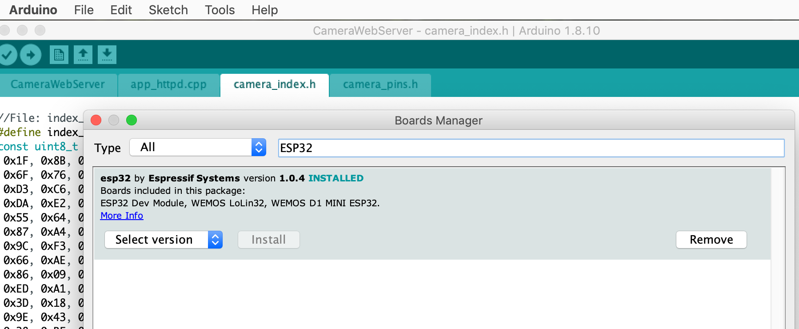
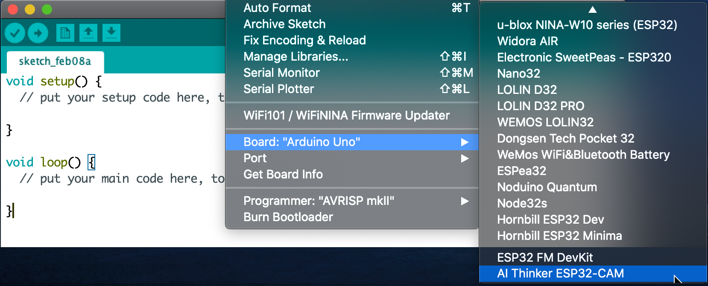
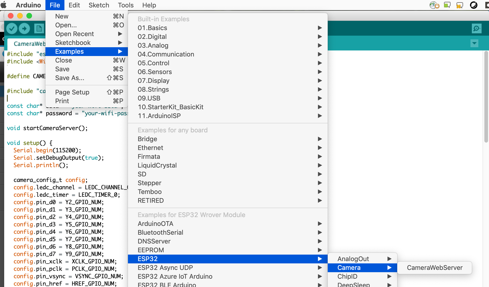
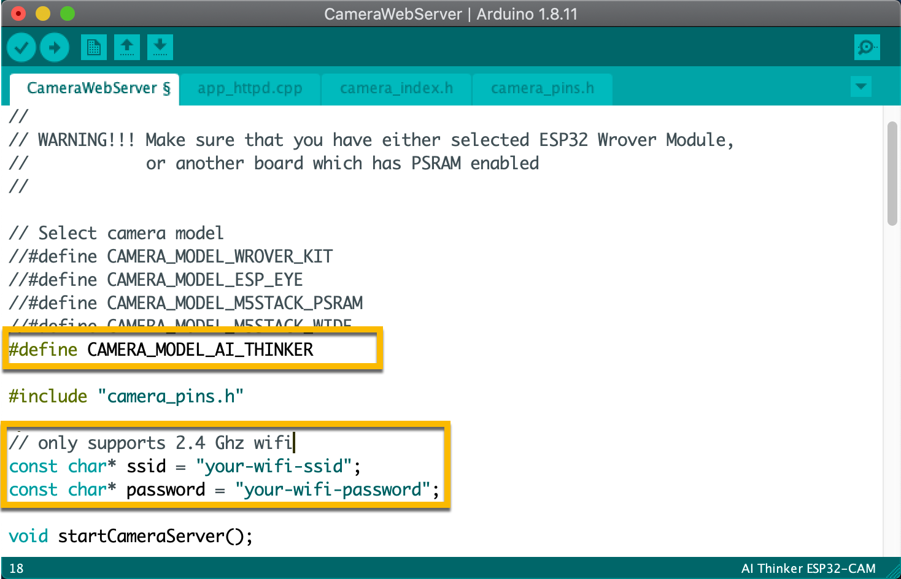
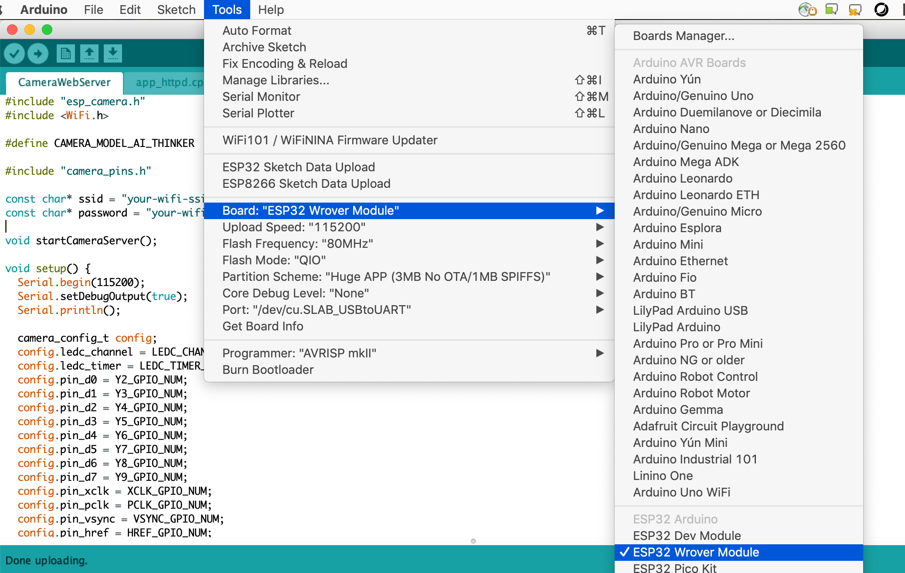

*Quick links :*
[Home](/README.md) - [**Part 1**](../part1/README.md) - [Part 2](../part2/README.md) - [Part 3](../part3/README.md) - [Sensors](/en/sensors/README.md)
***
**Part 1** - [Setup](PREREQ.md) - [**First App**](FIRSTAPP.md) - [WIFI](WIFI.md) - [LED](LED.md) - [DHT](DHT.md) - [Cloud](IOTCLOUD.md)
***

# Programming ESP32 Camera 
This turtorial is a quick guide to setup and get started with ESP-32 Camera microcontroller board. 

## Parts used for this tutorial

- ESP32-CAM with OV2640 camera module
- Female to female jumpers (6 of them)
- The ESP32-CAM doesn’t come with a USB connector, so you need an FTDI programmer to upload code through the U0R and U0T pins. 

You can get the kit here: 
https://www.amazon.com/HiLetgo-ESP32-CAM-Development-Bluetooth-Raspberry/dp/B07RXPHYNM/

## Integrated Development Environment

This tutorial uses the latest version Arduino IDE to develope the code and load it to the ESP32 CAM. If you're using Mac OS like me, then go here to download the IDE: https://www.arduino.cc/en/Main/Software

Once you have the IDE installed,
Go to File –> Preferences and add the link https://dl.espressif.com/dl/package_esp32_index.json to the Additional Boards Manager URLS.

Then go to `Tools >> Board: >> Board Manager ...` on the menu bar, then search for `ESP32` and install it

Now, go to the Board configurations and select your ESP32-CAM board, in this case “AI Thinker ESP32-CAM“.

## Load the CameraWebServer example code

Assuming you've had the parts wired up together and connected them to your computer with the Arduino IDE opened. Now open the example code by accessing the menu item following this screenshot

Change the content of `CameraWebServer.ino` file to make it look like this (Keep the `#define CAMERA_MODEL_AI_THINKER` definition and Enter your wifi SSID and Password in)

Select your serial port.  If you don't see the serial port, you will need to install a serial port driver for your FTDI serial programmer.  A common serial chip used is the CP2101 and install the appropriate driver for your OS from this link:
https://www.silabs.com/products/development-tools/software/usb-to-uart-bridge-vcp-drivers

Take notice that in the `void setup()` function, we set `Serial.begin(115200);`, so make sure you setup the same `speed` value on the Serial Monitor configuration. Serial Monitor is used for debug output and you can open it by going to the Arduino Menu, select Tools / Serial Monitor.  See below:

## Connect the parts

Here is the how you wire the ESP32-CAM to the FTDI programmer part

(Source: Internet)

Notice that the GPIO 0 pin needs to be connected to GND in order for the code to be uploaded. 

## Upload the code

Before uploading the code, make sure the port that the ESP32-CAM is connected to is selected. Something like this:

The partiion option

and the right Board is selected, like this:

Press the Reset button on the ESP32-CAM then upload the code to the ESP32-CAM, either using the `Upload` button on the IDE, or `Sketch >> Upload`

Wait until the code uploading done, then disconnect the GPIO 0 from the GND

Now open the serial monitor window `Tools >> Serials Monitor` and press the Reset button on the ESP32 board again

You will see something like this that tells you the Video server is ready

Now you can open a browser on you computer (which is on the same network with the ESP32-CAM board) to access the link, in this case, `http://192.168.1.252/`and start streaming the video

The ESP32-CAM board has the built-in Face detection/recognition capability which is a good foundation to start building your solution. 

***
*Quick links :*  
**Part 1** - [Setup](PREREQ.md) - [**First App**](FIRSTAPP.md) - [WIFI](WIFI.md) - [LED](LED.md) - [DHT](DHT.md) - [Cloud](IOTCLOUD.md)
***
[Home](/README.md) - [**Part 1**](../part1/README.md) - [Part 2](../part2/README.md) - [Part 3](../part3/README.md) - [Sensors](/en/sensors/README.md)